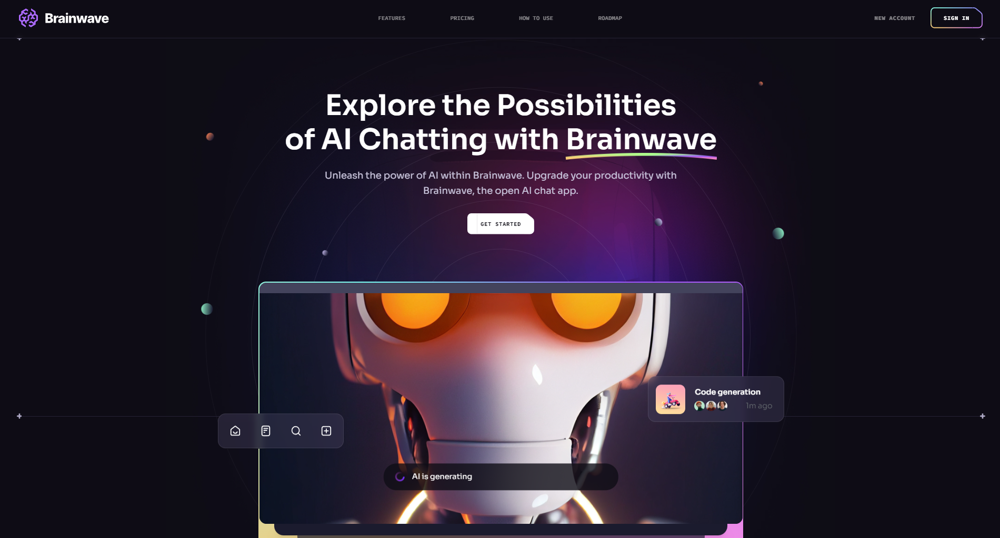

  <h1 align="center">Brainwave - Modern Website</h1>

   
  

     </img>
  

   

## Introduction

Welcome to "Brainwave," a modern home-page designed with the latest UI trends and technologies. 

This project demonstrates my front-end development skills and my ability to create engaging user experiences.

## Deployment

**Warning:** It does take a few seconds to load the images.

The project is deployed on Vercel. You can view the live site here: [Brainwave on Vercel](https://modern-site-brainwave.vercel.app)

## Features

- **Responsive Design:** Built to look great on any device, from mobile phones to desktop monitors.
- **Sleek Animations:** Enhanced user experience with smooth and subtle animations.
- **Clean Layout:** Organized and easy-to-navigate interface.

## Technologies Used

- **UI Design:** Leveraged the UI8 design layout for a professional and aesthetically pleasing appearance.
- **Front-End Development:** Developed using JavaScript, React, and CSS for a seamless and interactive user experience.
- **Guidance:** Followed the comprehensive tutorial by JavaScriptMastery to ensure best practices and cutting-edge techniques.

## Learning Experience

This project was a fantastic learning opportunity. Working through the step-by-step process provided by JavaScriptMastery, I gained valuable insights into modern web development practices. The additional animations and customizations I implemented further enhanced my skills and understanding.

## Personal Touch

I aimed to go beyond the basics by incorporating unique animations and interactions, making the user experience as enjoyable and intuitive as possible. This project reflects my dedication to front-end development and my eye for design detail.

## Conclusion

I hope "Brainwave" showcases my ability to build modern, responsive, and visually appealing websites. Feel free to explore the project and reach out if you have any questions or feedback.

Thank you for taking the time to explore my work.

  <strong>- Kaustubh Siriki</strong>

